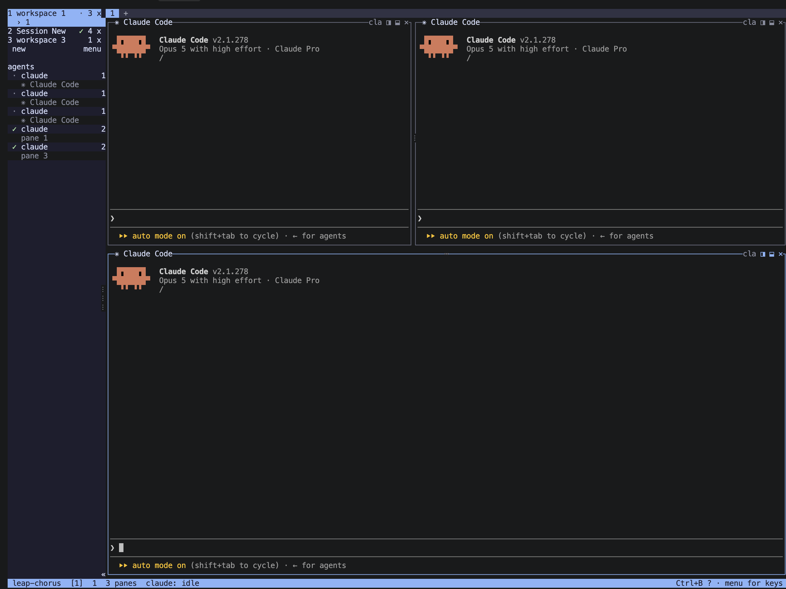
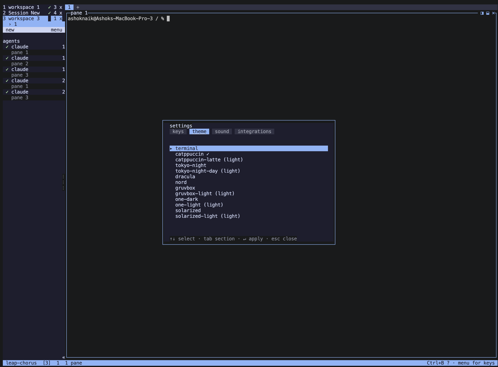
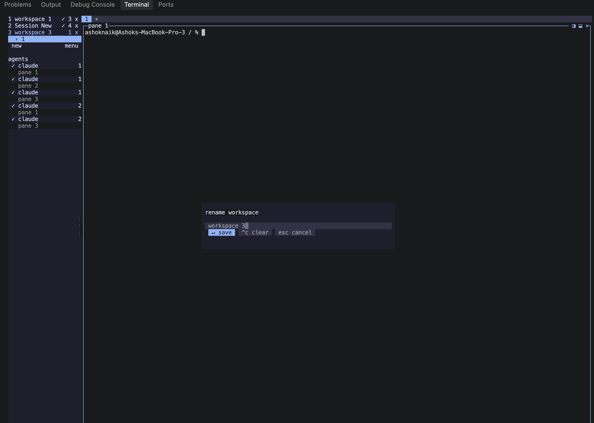
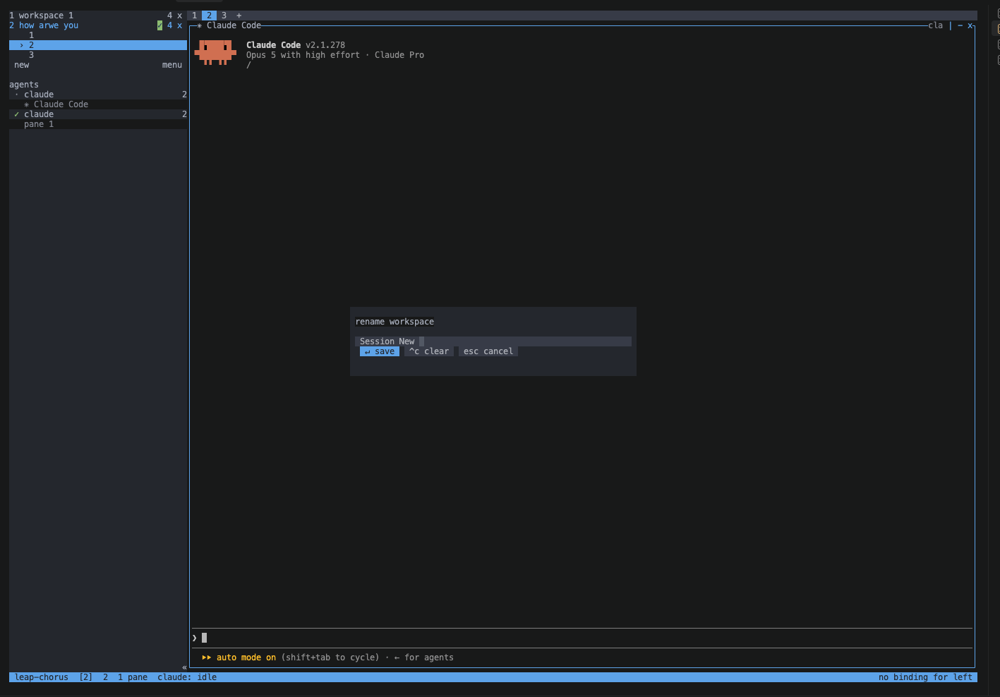

# chorus

A terminal multiplexer built for AI coding agents. Split panes like tmux, but every
pane knows *which* agent is running in it and whether that agent is idle, working,
blocked on you, or done — and the sidebar says so at a glance.

A TypeScript rewrite of [herdr](https://github.com/herdrdev/herdr) (Rust, Apache-2.0).
See `NOTICE` for attribution.



## Why

Run five agents at once and the hard part stops being the terminal and starts being
*attention*: which one is stuck waiting for you to approve something? leap-chorus
answers that without you visiting each pane.

- **Agent state per pane**, surfaced in a sidebar that rolls up to the workspace.
- **Detach and survive.** The daemon owns the PTYs; the client can die, update and
  reattach while every agent keeps running.
- **Git worktrees**, so two agents never fight over one checkout.
- **tmux keys**, all remappable.

## Requirements

- Node >= 22 (`.nvmrc` pins 24)
- pnpm 10
- macOS or Linux — Windows is deliberately not supported

## Install and run

```bash
pnpm install          # also repairs node-pty's spawn-helper permissions
pnpm build
```

That builds everything but installs no command. To get `leap-chorus` on your PATH,
symlink the built entry into a directory that is already there:

```bash
ln -s "$PWD/packages/client/dist/main.js" ~/.local/bin/leap-chorus
```

`pnpm link --global` works too, but only after `pnpm setup` *and* opening a new shell —
`setup` writes `PNPM_HOME` to your shell profile and the session you ran it in has not
read it yet, so linking immediately afterwards fails with `ERR_PNPM_NO_GLOBAL_BIN_DIR`.
The symlink needs neither.

Then start it:

```bash
leap-chorus                  # a shell in one pane
leap-chorus -- /bin/bash     # pick the program
leap-chorus --config ./my.toml
```

Without the link step there is no `leap-chorus` command — a source checkout builds to
`packages/client/dist/main.js`, and only the release tarball ships a launcher. Run it
directly if you would rather not link:

```bash
node packages/client/dist/main.js
```

Open a pane and launch an agent in it (`claude`, `codex`, `opencode`) — detection is
automatic, nothing to configure.

Press `Ctrl-B ?` for settings: keys, theme, sound and agent integrations.



It runs fine inside another terminal, including VS Code's:



### Stopping it

`Ctrl-B d` **detaches** — the daemon and every pane keep running. That is the point of
the architecture, so to actually stop everything:

```bash
leap-chorus kill-server
```

It will not start a daemon just to kill it.

## Keys

The prefix is `Ctrl-B`, as in tmux. Every binding is configurable.

| Key | What it does |
|---|---|
| `C-b %` / `C-b "` | split left/right, split top/bottom |
| `C-b h j k l` | move focus |
| `C-b H J K L` | move the divider |
| `C-b { }` | swap the focused pane with its neighbour |
| `C-b o` / `C-b Tab` | next pane |
| `C-b z` | zoom the focused pane |
| `C-b x` | close the focused pane |
| `C-b c` / `C-b &` | new tab / close tab |
| `C-b n` / `C-b p` | next / previous tab |
| `C-b ,` | rename the tab |
| `C-b P` | rename the focused pane |
| `C-b w` | new workspace |
| `C-b )` / `C-b (` | next / previous workspace |
| `C-b $` | rename the workspace |
| `C-b ?` | settings |
| `C-b s` | show or hide the sidebar |
| `C-b e` / `C-b f` / `C-b g` | the docked panel: files, search, source control |
| `C-b PgUp` / `PgDn` / `End` | scroll this pane's history |
| `C-b r` / `C-b R` | force a repaint / reload the config |
| `C-b d` | detach — the daemon and every pane keep running |
| `C-b q` | quit, killing the panes |
| `C-b C-b` | send a literal `Ctrl-B` |
| click | focus a pane, a workspace in the sidebar, or a tab |
| click a `⋮` grip | rename the focused pane (drag the same grip to resize) |
| wheel | scroll a pane that has not asked for mouse reports |

If clicks do nothing, the terminal is not forwarding them: macOS Terminal.app needs
*View → Allow Mouse Reporting*, and an outer multiplexer will eat them first.

## File explorer

`Ctrl-B e` opens a file tree for the focused pane's repository — or its working
directory when that is not a checkout. It is one of three views in a single docked
panel, with an activity bar across the top: `1` files, `2` search, `3` source
control, or click a chip. Each view keeps its own cursor and scroll while the panel
is open, so switching and switching back lands you where you left.

| Key | Action |
|---|---|
| `↑↓` / `j k` | move |
| `Enter` / `l` / `→` | expand a directory, or open a file in a pane |
| `h` / `←` | fold it, or jump to the parent |
| `.` | show hidden files |
| `r` | refresh |
| `Esc` / `b` / `q` | close |

Directories are listed one at a time as you open them, so a checkout with a
`node_modules` in it costs nothing until you look inside. A file carries its git
status letter; a folded directory carries a `·` when something under it changed.
Expanded directories stay open across a refresh.

Glyphs are ASCII on purpose. Nerd Font icons would look better and cost correctness —
they sit in the Private Use Area, get measured as one column, and shift every column
after them on a terminal that disagrees. That is the bug `pane-buttons = ascii`
already exists to escape.

## Search

The middle view of the docked panel, in two modes.

**Quick open** is `Ctrl-P`, from whichever view you are in. The file list is fetched
once and filtered in the client as you type — fuzzily, so `clsrch` finds
`packages/client/src/search.ts` — and `Esc` puts you back in the view you came from
rather than closing the panel. Enter opens the file in a pane running your `$PAGER`.

**Content search** is `Ctrl-F`, or `Ctrl-B f`. Type a pattern and press Enter; it
runs once per submit rather than on every keystroke, because it reads every file
under the root. Results are grouped by file, and Enter on one opens that file at
that line.

| Key | Action |
|---|---|
| `Ctrl-P` / `Ctrl-F` | quick open / content search |
| `Tab` / `Shift-Tab` | query → include → exclude → results |
| `Alt-C` / `Alt-W` / `Alt-R` | case-sensitive / whole word / regular expression |
| `Enter` | search, or open the result under the cursor |
| `↑↓` | move in the results |
| `Esc` | close (or leave quick open) |

Include and exclude take comma-separated globs — `*.ts, docs` — and a bare directory
name means everything under it. Every result set is bounded in the daemon: 1,000
matches, 20,000 files, 15 seconds, and 500 characters of any one line. When a bound
is hit the status line says which one, because "1,000 matches" and "1,000 matches and
there were more" are different facts.

**Search needs `ripgrep`.** herdr-sidebar compiles ripgrep's crates into its binary;
we shell out to `rg` instead, the same way diffs go to your pager. Without it, quick
open still works inside a git repository — it falls back to `git ls-files` — and
content search tells you what to install, with the command for your platform. It
says "not on the daemon's PATH" rather than "not installed", because a daemon started
outside a login shell may not see a binary you can run.

## Source control

`Ctrl-B g` opens a Source Control panel docked where the sidebar sits, for the
repository of whatever pane has focus — so with a fleet of agents in separate
worktrees, switching pane switches repository with nothing to configure.

It follows the shell's *current* directory, not the one the pane started in, so a
pane you have `cd`-ed into a checkout shows that checkout. The daemon reads the live
directory from the process each time it is asked, because `cd` announces itself to
nobody.

| Key | Action |
|---|---|
| `↑↓` / `j k` | move |
| `Enter` | stage or unstage the file under the cursor |
| `a` / `u` | stage everything / unstage everything |
| `c` | commit what is staged |
| `d` | discard the file under the cursor (asks first) |
| `o` | open its diff in a new pane |
| `b` | switch branch |
| `S` | sync: pull --rebase --autostash, then push |
| `r` | refresh |
| `Esc` / `q` | close |

The panel takes the keyboard while it is open — `d` has to mean discard, not a
keystroke for the shell behind it — and `Esc` hands it back. `Ctrl-B` still reaches
the multiplexer from inside.

Discard distinguishes the two cases it covers, because only one is recoverable: a
tracked file is restored from the index, an untracked one is deleted. The
confirmation says which. Diffs open in a pane running `git diff`, so they go through
whatever pager you already configured — delta, less, anything.

## Controlling panes from a script

Anything the TUI does to a pane, the CLI can do without a terminal attached — for a
shell script, an agent's hook, or a tool that wants to drive the session. The verbs
mirror herdr's, so anything written against that CLI invokes the same shapes.

```bash
leap-chorus pane list                    # every pane as JSON: id, cwd, agent, status
leap-chorus pane open --right            # split, print the new pane's id
leap-chorus pane open --down --command nvim --no-focus
leap-chorus pane focus <pane>
leap-chorus pane zoom <pane> --on        # --off, or neither to toggle
leap-chorus pane close <pane>
```

None of these start a daemon: asking about panes that would not exist should say so,
not create them. They exit 1 when no daemon is running and 2 on a bad invocation.

## Agent states



| Badge | Meaning |
|---|---|
| `claude ·` | idle — at its prompt, nothing happening |
| `claude *` | working |
| `claude !` | **blocked on you** — a permission prompt, a question |
| `claude ✓` | done — the agent exited, the pane is still open |
| `claude ?` | running, but its state could not be read |

A glyph and not just a colour, so it survives a monochrome terminal and colour
blindness. A workspace row shows the worst state inside it, which is how a blocked
agent in a workspace you cannot see gets noticed.

State comes from three sources, in order of authority: an **installed hook** (the agent
tells us, and it costs nothing per byte), the **screen** matched against a per-agent
manifest, and the **process table**, which is the only thing that can say `done`. The
screen overrules a live hook in exactly one case — a *visible* blocker — because a
missed permission prompt would otherwise leave a pane showing `working` while it
silently waits for you.

Adding an agent is a TOML file, not code.

### When a detection rule goes stale

Rules break the day an agent ships a new spinner, so they are data and reloadable:

```bash
# what the engine sees, and which rules fired against which region
leap-chorus agent read <pane> --source detection
leap-chorus agent explain <pane>

# edit, then reload without restarting the daemon or losing a pane
$EDITOR ~/.config/leap-chorus/agent-detection/claude.toml
leap-chorus agent reload-manifests
```

A broken override falls back to the bundled manifest and says why, rather than leaving
you with no detection mid-edit.

## Config

TOML, read from `$LEAP_CHORUS_CONFIG`, else `$XDG_CONFIG_HOME/leap-chorus/config.toml`,
else `~/.config/leap-chorus/config.toml`. A missing file is normal; an unreadable one
starts on the defaults and says why in the status bar. `C-b R` re-reads it without
disturbing a single pane.

```toml
[general]
shell = "/bin/zsh"      # empty: the login shell
scrollback = 5000
mouse = true
mouse-hover = true      # highlight the sidebar row under the pointer (needs DEC 1003)

[ui]
sidebar = true
sidebar-width = 22
tab-bar = true

[theme]
name = "catppuccin"     # or set individual roles below
agent-blocked = 1       # palette index; the state that is waiting on you

[sound]
agent-blocked = true    # play when an agent needs you
agent-done = true
# done-path = "~/sounds/ding.mp3"     # optional: your own files instead
# blocked-path = "~/sounds/alert.mp3"

[keys]
prefix = "C-a"

[keys.bindings]         # added to the defaults; "" unbinds
"|" = "pane.split-right"
"%" = ""
```

Notifications play through your system's audio player — `afplay` on macOS, one of
`paplay`/`pw-play`/`ffplay`/`mpg123`/`mpv` on Linux. If none is installed, leap-chorus
falls back to the terminal bell, which many terminals ignore (VS Code's integrated
terminal does by default). `LEAP_CHORUS_DISABLE_SOUND=1` silences playback entirely.

A sound fires on the *transition* worth interrupting for: any agent becoming blocked,
and an agent finishing a turn it was working on. An idle agent exiting is you quitting
it, so that one stays quiet.

Bundled themes: `terminal`, `catppuccin`, `catppuccin-latte`, `tokyo-night`,
`tokyo-night-day`, `dracula`, `nord`, `gruvbox`, `gruvbox-light`, `one-dark`,
`one-light`, `solarized`, `solarized-light`.

## Architecture, in one paragraph

Two long-lived processes. A **daemon** owns every PTY and the terminal state
(`node-pty` + `@xterm/headless`) and exposes a versioned unix socket. A **client**
attaches, pulls cell snapshots, renders them, and sends input. The client can die,
update and reattach; the daemon and its PTYs survive. That split is what makes live
updates possible without passing file descriptors over unix sockets — which Node
cannot do.

| Package | What it is |
|---|---|
| `@leap-chorus/core` | the session model as pure data: state, layout tree, actions, persistence, config schema. **Zero runtime dependencies**, asserted by a test |
| `@leap-chorus/config-loader` | TOML text → object, and the config search path |
| `@leap-chorus/detect` | the agent detection engine: manifests, regions, rule gates, process table |
| `@leap-chorus/protocol` | wire messages, NDJSON framing, version negotiation |
| `@leap-chorus/daemon` | PTY ownership, terminal emulation, snapshots, worktrees, integrations, the socket endpoint |
| `@leap-chorus/input` | terminal input: framing, key and mouse parsing, encoding, keybinding tables |
| `@leap-chorus/tui` | cell buffer, widgets, frame diff, ANSI encoder, raw terminal |
| `@leap-chorus/client` | attach, compose snapshots into frames, the app and its chrome |

Data lives under `$LEAP_CHORUS_DATA_DIR`, else `$XDG_DATA_HOME/leap-chorus`, else
`~/.leap-chorus` — the socket, the instance lock, a JSON log and the session layout,
each named with the protocol version so a new daemon can bind a new endpoint while an
old one keeps serving old clients.

## Development

```bash
pnpm test        # builds first — the integration tests run a real detached daemon
```

The tests run from `dist/`, not from the TypeScript sources: what they prove is about
process lifetime. Phase 1's flood test takes 30 seconds by design;
`LEAP_CHORUS_BACKPRESSURE_SECONDS=5` shortens it while iterating, but do not commit a
shorter default.

```bash
node bench/dist/render-scale.js [--seconds N]   # writes bench/RESULTS.md
```

Do not run two benchmarks at once — they compete for the machine and the numbers become
nonsense.

### Packaging

```bash
node scripts/build-app.mjs                    # bundle, node-pty externalized
node scripts/package-tarball.mjs --slot <id> --node-dir <pinned node>
sh scripts/smoke-tarball.sh <tarball>         # prove it runs with nothing installed
```

Six slots, not four — a glibc binary does not load on Alpine:

```
linux-x64-glibc   linux-arm64-glibc
linux-x64-musl    linux-arm64-musl
darwin-x64        darwin-arm64
```

Each tarball carries the app, a pinned Node runtime, and the one native addon its slot
can load. The glibc floor is **2.31** (Ubuntu 20.04), asserted in CI by reading the
shipped `.node`'s symbol versions — a green build on a newer runner is not evidence.

## License

Apache-2.0. See `LICENSE` and `NOTICE`.
